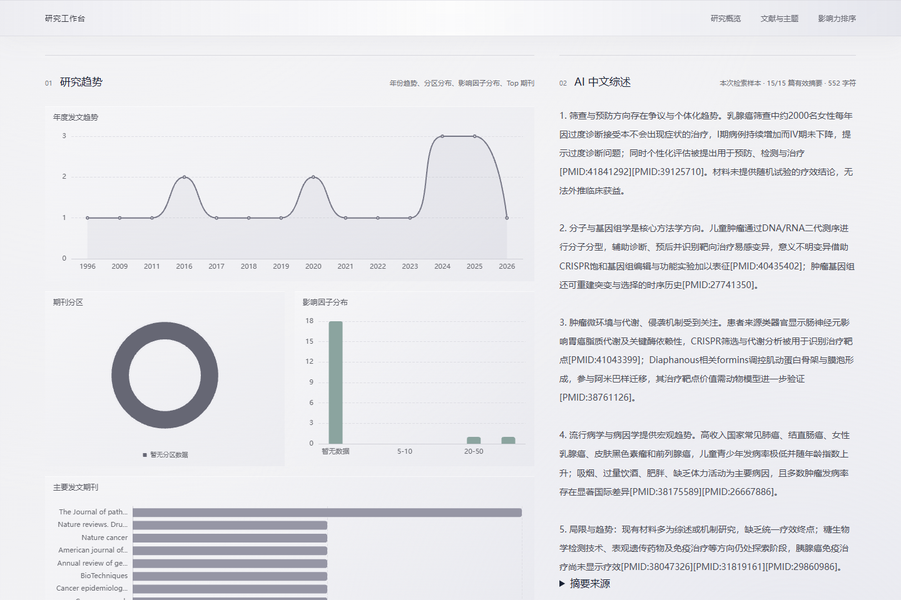
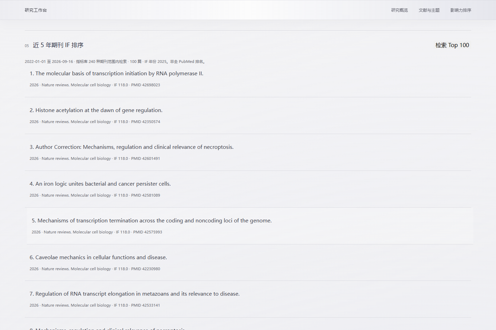

# PubMed Atlas

### 从一个研究问题，到可追溯的文献分析。

PubMed Atlas 将文献检索、期刊指标、研究趋势与中文摘要综述放在同一个工作台中。以 Python 为核心，通过轻量网页界面组织结果，让研究者能够看到结果背后的文献、数据来源和计算范围。

**Python · FastAPI · pandas · ECharts · Three.js · Docker**

## 看它如何工作

[](docs/media/pubmed-atlas.mp4)

[观看完整操作录屏 MP4](docs/media/pubmed-atlas.mp4) · [查看工作台截图](docs/media/workspace.png)

录屏使用实际运行的网页和真实 PubMed 请求，依次展示关键词检索、返回数量选择、统计图表、期刊 IF 来源、主题词、独立 Top 100 检索、AI 中文综述和摘要来源。综述由 DeepSeek 基于本次排名文献的摘要实际生成，视频未使用模拟检索结果或预写综述替换真实响应。GIF 为加速预览，MP4 保留原速操作。

## 一个连续的研究流程

| 工作阶段 | 可以得到什么 |
| --- | --- |
| 发现文献 | 关键词检索 PubMed，选择返回 10 / 20 / 30 / 40 篇，获取标题、摘要、年份、作者、期刊、DOI 与 PMID |
| 理解结果 | 年份趋势、期刊分区、IF 分布、主要期刊和标题摘要高频主题词 |
| 追溯指标 | 展示 IF、指标年份、出版社来源及本次样本的覆盖率 |
| 筛选重点 | 独立检索近五年文献，按已收录期刊 IF 排序，返回最多 100 篇 |
| 整理证据 | 从有效摘要中选择材料，生成约 500 字中文分点综述，并校验引用的 PMID |



## 我如何处理三个关键问题

### 1. PubMed 没有 IF 字段，指标从哪里来？

我把文献数据和期刊指标作为两个独立来源处理。PubMed 提供文献，指标表提供 IF、分区、年份和来源。匹配优先使用 ISSN，其次使用规范化名称及明确维护的别名；遇到冲突保留未匹配状态。

当前内置快照包含 **240 种期刊、2025 指标年**，主要来自 [Frontiers](https://www.frontiersin.org/about/impact) 和 [Nature Portfolio](https://www.nature.com/nature-portfolio/about-journals/journal-metrics)，另有逐条核验的期刊页面。页面支持导入同一指标年份的 CSV，校验通过后原子替换当前数据表。

IF 缺失时不填零、不估算，也不以 CiteScore 或 SJR 替代。分区缺失与 IF 缺失分别处理：有 IF 的记录仍可排序。IF 是期刊级指标，不能直接代表单篇论文的质量或影响力。

### 2. 显示 20 篇，怎样找 Top 100？

主检索用于快速浏览，Top 100 使用独立的数据获取流程。先按指标表中的期刊 IF 降序，再对每种期刊发起包含关键词和日期范围的 PubMed 查询，分页获取、按 PMID 去重。已有 100 篇合格结果时，更低 IF 的期刊无法进入前 100，可以停止后续查询。

近五年按当年及前四个自然年计算，独立检索的结束日期为当天。分界处相同 IF 可能有并列文献，返回其中最多 100 篇。

排名范围限定为**当前指标表覆盖的期刊**，不是全 PubMed 或全量 JCR 排名。记录解析不完整或达到检索上限时，响应会给出不完整标识。首页的分布图描述已返回样本，PubMed 总命中数单独展示。



### 3. 摘要很多，怎样控制综述质量？

我先剔除缺少摘要或无有效 PMID 的记录并去重，再按期刊 IF 和年份选择材料。单篇摘要最多 800 字符，总上下文最多 12,000 字符，最多选用 20 篇。页面展示实际纳入的来源数和 PMID 链接，Top 100 完成后使用这批排名文献的摘要生成综述。

输出需以中文分 4–5 点呈现，去掉引用及空白后正文为 400–650 字符，每点引用的 PMID 必须来自输入材料。校验失败时最多重试一次。这些检查限制格式和引用范围，不能替代人工判断结论是否受证据支持。

模型不可用时，工作台保留统计和排名，并显示失败原因及已整理的摘要来源，不生成没有证据支持的研究结论。

## 快速运行

需要 Python 3.11+，或安装了 Docker Compose 的 Docker 环境。

```bash
git clone https://github.com/Chilong175/PubMed-Atlas.git
cd PubMed-Atlas
```

创建本地配置文件：

```powershell
# Windows PowerShell
Copy-Item .env.example .env
```

```bash
# macOS / Linux
cp .env.example .env
```

在 `.env` 中填写自己的配置，实际密钥不进入版本库：

```dotenv
PUBMED_API_KEY=your_ncbi_api_key
AI_PROVIDER=deepseek
AI_MODEL=deepseek-flash
AI_API_KEY=your_deepseek_api_key
DATABASE_URL=sqlite:///data/pubmed_demo.db
USE_MOCK_ON_ERROR=true
```

### Docker

```bash
docker compose up --build
```

访问 [工作台](http://localhost:8000)、[交互式 API 文档](http://localhost:8000/docs) 或 [健康检查](http://localhost:8000/health)。`data/` 通过卷挂载持久化。

### 本地 Python

```bash
python -m venv .venv
```

```powershell
# Windows PowerShell
.\.venv\Scripts\Activate.ps1
```

```bash
# macOS / Linux
source .venv/bin/activate
```

```bash
python -m pip install -r requirements.txt
python -m uvicorn app.main:app --host 127.0.0.1 --port 8000 --reload
```

普通 PubMed 检索失败时，`USE_MOCK_ON_ERROR=true` 可启用页面明确标注的本地样例。独立 Top 100 失败会报告错误，不以样例填充排名。真实 AI 综述需要可用的 DeepSeek 凭证。

## 架构与代码

```text
浏览器工作台：HTML / CSS / JavaScript + ECharts + Three.js
                         |
                      FastAPI
       +-----------------+------------------+
       |                 |                  |
 PubMed E-utilities  期刊指标 / 统计       摘要整理 / DeepSeek
 esearch + efetch    CSV / pandas        长度及 PMID 校验
```

| 路径 | 职责 |
| --- | --- |
| `app/api/pubmed.py` | 检索、分析、指标导入、排名与综述接口 |
| `app/services/pubmed_client.py` | NCBI 请求与 XML 解析 |
| `app/services/journal_metrics.py` | 指标表校验与原子导入 |
| `app/services/analyzer.py` | 指标匹配、分布统计与词频 |
| `app/services/impact_search.py` | 独立 Top 100 检索 |
| `app/services/reviewer.py` | 摘要预算、模型调用、输出校验 |
| `app/db.py` | SQLite 检索历史与文献存储基础能力 |
| `static/` | 工作台、图表及 3D 场景 |
| `scripts/refresh_publisher_metrics.py` | 出版社指标快照刷新 |
| `tests/` | 解析、匹配、排名、综述、存储与接口测试 |

SQLite 存储模块已有独立实现与测试，目前尚未接入主检索请求的自动缓存链路。

## 接口速览

| 方法 | 路径 | 用途 |
| --- | --- | --- |
| POST | `/api/search` | 普通关键词检索 |
| POST | `/api/analyze` | 统计提交的文献样本 |
| POST | `/api/top-impact` | 对提交的文献做 IF 排序 |
| POST | `/api/top-impact/search` | 独立检索近五年 Top 100 |
| POST | `/api/review` | 整理摘要并生成中文综述 |
| GET | `/api/metrics` | 当前指标表状态 |
| GET | `/api/metrics/template` | CSV 导入模板 |
| POST | `/api/metrics/import` | 校验并导入指标 |

## 验证与维护

```bash
python -m pip install httpx
python -m unittest discover
```

`httpx` 用于 FastAPI 接口测试。测试覆盖日期上下界、独立 100 篇排名、PMID 去重、未知指标、导入失败保留旧表、摘要预算、引用校验和故障处理。

更新指标快照：

```bash
python -m scripts.refresh_publisher_metrics
```

程序先核验来源年份和表结构，全部校验通过后替换文件；跨指标年更新需同步核验单刊补充记录。详见 [数据说明](data/README.md)。

后续重点：扩充有授权、可追溯的期刊指标来源，接入持久化检索历史，并为长时间排名检索增加进度与取消操作。
